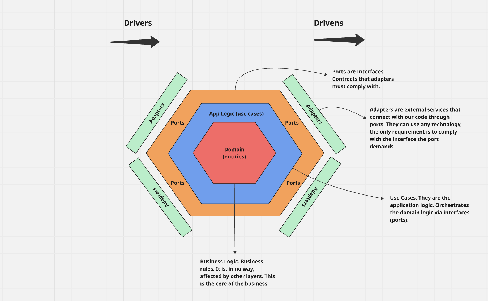

# Hexagonal Architecture

This repo is just some example code/boilerplate in Go to have handy and understand the basics of the hexagonal architecture structure.

## Characteristics

### 🧱 Separation of Concerns
Clear distinction between core business logic (the "hexagon") and the infrastructure or external world.

Encourages clean layering: domain, application, adapters (inward and outward).

### 🔌 Ports and Adapters
External actors (e.g., APIs, UIs, CLI, queues, databases) interact with the core logic only via ports (interfaces).

Adapters implement those ports, allowing the core to remain unaware of external dependencies.

### ♻️ Dependency Inversion Principle
The core does not depend on external details.

Infrastructure (e.g., storage, HTTP) depends on interfaces defined by the core — not the other way around.

### 🧪 Testability
Since domain and application logic are completely decoupled from infrastructure, you can easily test them in isolation using mocks or stubs.

### 🔧 Flexibility & Swapability
You can easily swap adapters: e.g., switch from in-memory DB to Postgres, or from REST to gRPC, without changing the core.

### 🚪 Technology Agnostic Core
The core (domain and use cases) doesn't care about tech choices like web frameworks, ORMs, or databases.

### 🧩 Modularity
Encourages breaking down applications into independent hexagons, which can be composed or deployed separately.

### 🔁 Symmetry in Input/Output
Treats both incoming (e.g., UI, HTTP) and outgoing (e.g., DB, email) interactions in a symmetrical way — via ports and adapters.

### 🚦 Controlled Boundaries
Communication across layers is strictly controlled via well-defined interfaces (ports), avoiding leaky abstractions.

### 🧼 Clean Architecture Compatibility
It's a practical and implementation-oriented variant of Clean Architecture.

Maps closely to Uncle Bob’s Entities → Use Cases → Interface Adapters → Frameworks model.

### 🔒 Secure by Design
Because external actors don’t directly touch the domain, and logic is encapsulated, it’s easier to enforce validation, auth, and audit boundaries.

### 🌱 Great for Growing Systems
Ideal for apps that will evolve with new delivery mechanisms or infrastructure changes (e.g., adding CLI, REST, GraphQL, or moving from SQL to NoSQL).

### 🤝 Business-Oriented Design
Forces teams to focus on the core use cases and business rules first, before tech implementation.
